#  ListUtils - Advance list functions from kotlin standard library

A set of utility functions to work with lists in a robust way. It is based on a pattern that I discussed earlier
called [Callback Pattern](https://community.kodular.io/t/a-better-callback-architecture-for-appinventor/178928). You can
further read that topic to get basic overview of how things work. You can also take a look at the official docs to get
more details about [ListFunctions](https://kotlinlang.org/docs/list-operations.html).

---

## :closed_book: Documentation

Let's take a look at what all the blocks do and then we shall see how to use them in your projects.

> 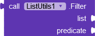
>
> Returns a list containing only elements matching the given predicate. Provides item to the predicate.

> 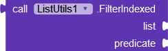
>
> Returns a list containing only elements matching the given predicate. Provides index & item to the predicate.

> 
>
> Returns a list containing all elements not matching the given predicate. Provides item to the predicate.

> 
>
> Returns a list containing all elements that are not null.

> 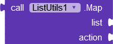
>
> Returns a list containing the results of applying the given transform function to each element in the original collection. Provides item to the action.

> 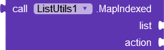
>
> Returns a list containing the results of applying the given transform function to each element in the original collection. Provides index & item to the action.

> 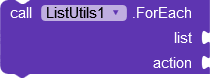
>
> Performs the given action on each element. Provides item to the action.

> 
>
> Performs the given action on each element. Provides index & item to the action.

> 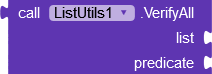
>
> Returns true if all elements match the given predicate. Provides item to the predicate.

> 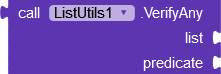
>
> Returns true if at least one element matches the given predicate. Provides item to the predicate.

> 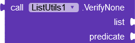
>
> Returns true if no elements match the given predicate. Provides item to the predicate.

> 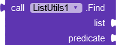
>
> Returns the first element matching the given predicate, or null if no such element was found. Provides item to the predicate.

> 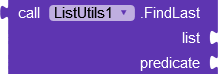
>
> Returns the last element matching the given predicate, or null if no such element was found. Provides item to the predicate.

> 
>
> Returns a list containing all elements except first n elements.

> 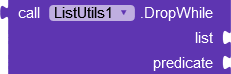
>
> Returns a list containing all elements except first elements that satisfy the given predicate. Provides item to the predicate.

> 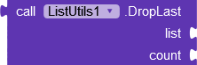
>
> Returns a list containing all elements except last n elements.

> 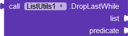
>
> Returns a list containing all elements except last elements that satisfy the given predicate. Provides item to the predicate.

> 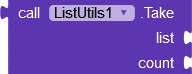
>
> Returns a list containing first n elements.

> 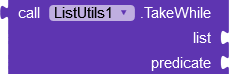
>
> Returns a list containing first elements satisfying the given predicate. Provides item to the predicate.

> 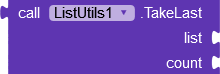
>
> Returns a list containing last n elements.

> 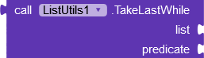
>
> Returns a list containing last elements satisfying the given predicate. Provides item to the predicate.

---

## :key: Key Concepts

There is one thing common in all of these functions. That is they accept a list. Then some functions take a prdicate
while some take an action to perform. Lets take a brief look into `Predicate` and `Action`.

---

### Predicate

A predicate is a function that takes some input and returns either true or false.

For example below is a predicate function that takes in a title and check whether the the search query that user entered
exists in the title.

> 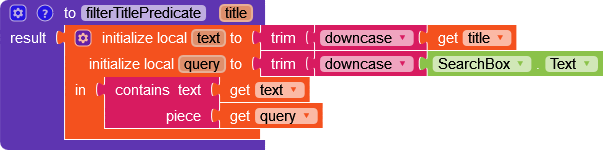

### Action

An action is a function takes some input but doesn't return any value.

For example below is an action that takes an error and logs it with the notifier. It doesn't return any value.

> 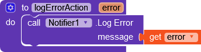

---

### Procedure Types

Almost all extension functions take predicate or action. The input procedure are further of two types. One takes only
item while the other takes index and item.

#### 1- Procedure With Item

The procedure below takes only the item.

> 

#### 2- Procedure With Index & Item

The procedure below takes index as well as the item. Always be careful about the sequence in such procedures. The first
parameter is index and second parameter is the actual item.

> 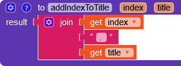

---

## Usage

Lets see a basic example in which we fill use `MapIndexed` and `Filter`. We will add index to all the titles and we will
filter them using a search box.

### :computer: UI Design

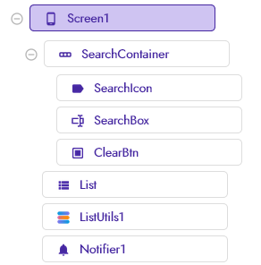

###  Blocks

1. Let's start by creating a list of titles. Create one more list that will contain filteredTitles.

> 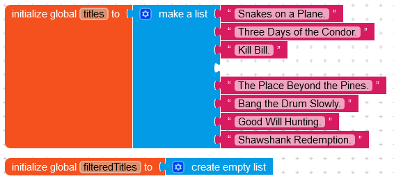

2. Create a function that updates `filteredList` data and also updates `ListView` elements.

> 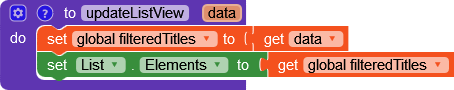

3. Create a function that takes `index` and `title` as input and returns a new title by appending index to the title.

> 

4. Create a function that takes in `title` as input and checks whether it contains `SearchBox.Text` (user entered query)
   .

> 

5. When screen initializes, we will create a local variable `titlesWithIndexes` that contains mapped titles. We will use
   a function called `MapIndexed` that provies index & item to the transformer action procedure. Pass the list of titles
   and the procedure name `addIndexToTitle` that we create in step 3. Now pass the variable `titlesWithIndexes` to
   the `updateListView` procedure that we created in step 2.

> 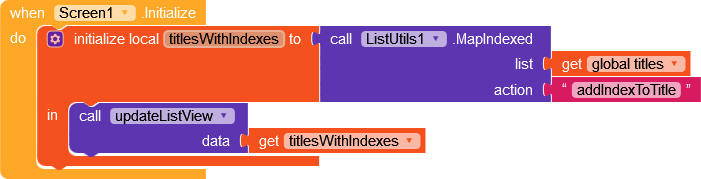

6. In order to add search functionality, we will use `SearchBox.OnTextChanged` event to filter data using `Filter`
   function whenever the search query changes. Create a local variable called `searchResult` and set its initial value
   to an empty list. Next set the value of searchResult to the `Filter` function from ListUtils. Pass the list of titles
   and `filterTitlePredicate` procedure name to the Filter function. Now repeat step 5 but change the list from `titles`
   to `searchResult` and we have a working search box.

> 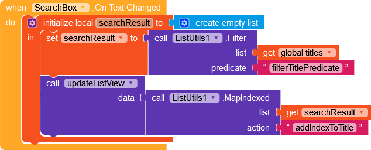

### :open_file_folder: Project Files

- AIA File : [ListUtils.aia|attachment](example/ListUtils.aia)

---

##  Note

When using a function that has word `Indexed` at the end, it expects a procedure that takes `index` and `item`. For
example, when we used `MapIndexed` function to add index to the title, the procedure accpted index as well as title. So
be careful when using `Indexed` functions.

> 

For functions that don't have word `Indexed` at the end, you can use procedure that accept only `item` as input. For
example, `filterTitlePredicate` that we used earlier takes only `title` as input.

> 

---

## Download Extension

### 1.0.0

- AIX File : [com.dreamers.listutils.aix|attachment](out/com.dreamers.listutils.aix)